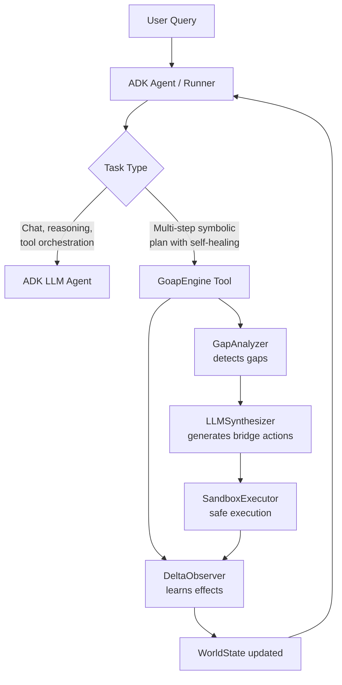

# Google ADK Integration

!!! abstract "At a Glance"
**Scenario**: Use `heal-my-goap` as the zero-token symbolic planner inside a Google ADK agent, while ADK handles LLM reasoning, tool calling, and multi-agent orchestration.
**Key Features Used**: `GoapEngine` as planner, `DeltaObserver` for effect learning, `LLMSynthesizer` for self-healing, ADK `Agent` + `Runner` for LLM-driven execution.

______________________________________________________________________

## Why Combine heal-my-goap with Google ADK?

| Concern | Google ADK | heal-my-goap |
|---------|------------|--------------|
| **LLM reasoning & chat** | ✅ Native (Gemini, multi-model) | ❌ Not a chat framework |
| **Tool calling** | ✅ Native `FunctionTool` | ❌ No LLM tool calling |
| **Multi-agent workflows** | ✅ `Workflow` (graph-based), `LoopAgent`, dynamic workflows | ❌ Single planner |
| **Symbolic planning (zero-token)** | ❌ LLM-based only | ✅ GOAP via `goapauto` |
| **Runtime effect learning** | ❌ Manual callbacks | ✅ `DeltaObserver` |
| **Self-healing / gap recovery** | ❌ Manual retry logic | ✅ `GapAnalyzer` + `LLMSynthesizer` |
| **State rollback on failure** | ❌ Not built-in | ✅ Automatic via `GoapEngine` |

**heal-my-goap complements ADK** — it doesn't compete. Use ADK for LLM-driven agent orchestration, and plug in `GoapEngine` as the deterministic, zero-token planner for complex multi-step tasks that require guaranteed correctness and self-healing.

______________________________________________________________________

## Architecture Overview



______________________________________________________________________

## Installation

```bash
# Install both frameworks
uv add google-adk heal-my-goap

# Or with pip
pip install google-adk heal-my-goap
```

Requires Python 3.10+ (ADK) and Python 3.13+ (heal-my-goap). Use Python 3.13 for full compatibility.

______________________________________________________________________

## Quick Start: GoapEngine as an ADK Function Tool

The simplest integration: wrap `GoapEngine.run()` as an ADK `FunctionTool`. The ADK agent decides *when* to invoke the planner; the planner handles *how* to achieve the goal.

```python
# adk_goap_agent/agent.py
from google.adk.agents import Agent
from google.adk.runners import Runner
from google.adk.sessions import InMemorySessionService
from google.genai import types

from heal_my_goap import (
    GoapEngine,
    WorldState,
    goal,
    action_from_tool,
    DeltaObserver,
    LLMSynthesizer,
    SandboxExecutor,
)


# 1. Define your domain tools (regular Python functions)
def check_disk_space(path: str) -> dict:
    """Check available disk space in GB."""
    import shutil

    total, used, free = shutil.disk_usage(path)
    return {"free_gb": free // (1024**3)}


def cleanup_temp_files() -> dict:
    """Remove temporary files to free disk space."""
    import tempfile, shutil

    temp_dir = tempfile.gettempdir()
    freed = 0
    for item in Path(temp_dir).glob("*"):
        try:
            if item.is_file():
                freed += item.stat().st_size
                item.unlink()
            elif item.is_dir():
                shutil.rmtree(item, ignore_errors=True)
        except Exception:
            pass
    return {"freed_mb": freed // (1024**2)}


def compress_logs() -> dict:
    """Compress old log files."""
    # Implementation omitted
    return {"compressed_mb": 150}


def alert_oncall(message: str) -> dict:
    """Send alert to on-call engineer."""
    # Implementation omitted
    return {"sent": True}


# 2. Convert tools to GOAP Actions with action_from_tool
tools = [
    action_from_tool("check_disk_space", "Check disk space", check_disk_space),
    action_from_tool(
        "cleanup_temp_files", "Clean temp files", cleanup_temp_files
    ),
    action_from_tool("compress_logs", "Compress logs", compress_logs),
    action_from_tool("alert_oncall", "Alert on-call", alert_oncall),
]

# 3. Initialize GoapEngine with self-healing
engine = GoapEngine(
    tools=tools,
    observer=DeltaObserver(),  # Learns action effects at runtime
    synthesizer=LLMSynthesizer(),  # LLM generates bridge actions for gaps
    executor=SandboxExecutor(),  # Safe subprocess execution
    storage_path=".goap_adk_actions.json",
)


# 4. Wrap engine.run() as an ADK FunctionTool
def plan_and_execute_goal(goal_description: str, target_free_gb: int) -> dict:
    """
    Invoke the GOAP planner to achieve a system goal.

    Args:
        goal_description: Human-readable goal (e.g., "free up disk space")
        target_free_gb: Target free space in GB

    Returns:
        Dict with execution result and final state
    """
    initial_state = WorldState(
        disk_free_gb=check_disk_space("/")["free_gb"],
        target_free_gb=target_free_gb,
        alert_sent=False,
    )

    result = engine.run(
        initial_state=initial_state,
        goal=goal(target_state={"disk_free_gb": target_free_gb}),
    )

    return {
        "success": result.success,
        "final_free_gb": result.final_state.get("disk_free_gb"),
        "steps_executed": len(result.plan) if result.plan else 0,
        "self_healed": result.self_healed,
        "synthesized_actions": [a.name for a in result.synthesized_actions]
        if result.synthesized_actions
        else [],
    }


# 5. Create ADK Agent with the GOAP tool
root_agent = Agent(
    model="gemini-flash-latest",
    name="system_admin_agent",
    description="System administrator that uses symbolic planning for complex maintenance tasks.",
    instruction="""
You are a system administration agent. For simple queries, answer directly.
For complex multi-step maintenance tasks (disk cleanup, log rotation, etc.),
use the 'plan_and_execute_goal' tool which invokes a symbolic GOAP planner
with self-healing capabilities.
""",
    tools=[plan_and_execute_goal],
)

# 6. Runner setup (standard ADK)
APP_NAME = "goap_adk_demo"
USER_ID = "admin"
SESSION_ID = "session_001"


async def main():
    session_service = InMemorySessionService()
    session = await session_service.create_session(
        app_name=APP_NAME, user_id=USER_ID, session_id=SESSION_ID
    )
    runner = Runner(
        agent=root_agent, app_name=APP_NAME, session_service=session_service
    )

    # Example interaction
    user_query = "Free up at least 5GB of disk space on the root partition"
    content = types.Content(role="user", parts=[types.Part(text=user_query)])

    async for event in runner.run_async(
        user_id=USER_ID, session_id=SESSION_ID, new_message=content
    ):
        if event.is_final_response():
            print("Agent:", event.content.parts[0].text)


if __name__ == "__main__":
    import asyncio

    asyncio.run(main())
```

______________________________________________________________________

## Advanced: GoapEngine as a Long-Running ADK Tool

For long-running plans, use ADK's [long-running function tools](https://google.github.io/adk-docs/tools-custom/function-tools/#long-running-function-tools) to stream intermediate progress.

```python
from google.adk.tools import ToolContext
from typing import AsyncGenerator


async def plan_and_execute_goal_streaming(
    goal_description: str,
    target_free_gb: int,
    tool_context: ToolContext,
) -> AsyncGenerator[dict, None]:
    """
    Streaming version that yields progress updates.

    The ADK agent receives intermediate results and can respond to the user
    while the plan is still executing.
    """
    initial_state = WorldState(
        disk_free_gb=check_disk_space("/")["free_gb"],
        target_free_gb=target_free_gb,
        alert_sent=False,
    )

    # Yield initial state
    yield {
        "status": "planning",
        "message": f"Planning to free {target_free_gb}GB...",
    }

    # Run engine (this is synchronous; in production, run in executor)
    result = engine.run(
        initial_state=initial_state,
        goal=goal(target_state={"disk_free_gb": target_free_gb}),
    )

    # Stream each step result
    if result.plan:
        for i, action in enumerate(result.plan):
            yield {
                "status": "executing",
                "step": i + 1,
                "action": action.name,
                "message": f"Executing {action.name}...",
            }

    # Final result
    yield {
        "status": "completed" if result.success else "failed",
        "success": result.success,
        "final_free_gb": result.final_state.get("disk_free_gb"),
        "self_healed": result.self_healed,
        "synthesized_actions": [a.name for a in result.synthesized_actions]
        if result.synthesized_actions
        else [],
    }
```

Register with ADK:

```python
from google.adk.tools import FunctionTool

streaming_tool = FunctionTool(
    name="plan_and_execute_goal_streaming",
    description="Execute a multi-step maintenance plan with streaming progress",
    execute=plan_and_execute_goal_streaming,
)

root_agent = Agent(
    model="gemini-flash-latest",
    name="system_admin_agent",
    tools=[streaming_tool],
)
```

______________________________________________________________________

## Integration Pattern: ADK 2.0 Graph Workflow + GoapEngine

For complex scenarios, combine ADK 2.0's **Graph Workflows** (`Workflow`) with GOAP planning. The `Workflow` class defines a graph of nodes (agents, functions, tools) with explicit edges for deterministic execution flow.

```python
from google.adk import Agent, Workflow, Event
from google.adk.agents.llm_agent import LlmAgent
from pydantic import BaseModel


# Define typed data passed between nodes
class DiagnosisResult(BaseModel):
    root_cause: str
    severity: str  # "low" | "medium" | "high"
    affected_components: list[str]


class PlanResult(BaseModel):
    plan_id: str
    steps: list[str]
    estimated_duration_min: int


class VerificationResult(BaseModel):
    success: bool
    details: str


# Sub-agent 1: Diagnosis (LLM-based) - using LlmAgent explicitly
diagnosis_agent = LlmAgent(
    model="gemini-flash-latest",
    name="diagnosis_agent",
    instruction="Analyze system metrics and identify the root cause. Output structured DiagnosisResult.",
    output_schema=DiagnosisResult,
    tools=[get_system_metrics, analyze_logs],
)


# Sub-agent 2: Planning (GOAP-based) - wrapped as a function node
def run_goap_planner(diagnosis: DiagnosisResult) -> PlanResult:
    """
    Invoke the GOAP planner to create a remediation plan based on diagnosis.
    This runs the GoapEngine and returns a structured plan.
    """
    # Map diagnosis to GOAP goal
    goal_desc = (
        f"Remediate {diagnosis.root_cause} ({diagnosis.severity} severity)"
    )
    target_state = {
        "system_healthy": True,
        "root_cause_resolved": diagnosis.root_cause,
    }

    initial_state = WorldState(
        disk_free_gb=check_disk_space("/")["free_gb"],
        target_free_gb=10,
        alert_sent=False,
        root_cause=diagnosis.root_cause,
        severity=diagnosis.severity,
    )

    result = engine.run(
        initial_state=initial_state,
        goal=goal(target_state=target_state),
    )

    return PlanResult(
        plan_id=f"plan_{result.plan_id}"
        if hasattr(result, "plan_id")
        else "plan_001",
        steps=[a.name for a in result.plan] if result.plan else [],
        estimated_duration_min=len(result.plan) * 2 if result.plan else 0,
    )


# Sub-agent 3: Verification (LLM-based) - using LlmAgent explicitly
verification_agent = LlmAgent(
    model="gemini-flash-latest",
    name="verification_agent",
    instruction="Verify the remediation succeeded and report status. Output structured VerificationResult.",
    output_schema=VerificationResult,
    tools=[get_system_metrics, run_health_checks],
)


# Router function for conditional edges
def route_by_severity(diagnosis: DiagnosisResult) -> Event:
    """Route to different handlers based on severity."""
    if diagnosis.severity == "high":
        return Event(route=["critical_path"])
    elif diagnosis.severity == "medium":
        return Event(route=["standard_path"])
    return Event(route=["monitor_path"])


# Handler functions for different severity paths
def critical_path_handler(_: Any) -> Event:
    return Event(
        message="CRITICAL: Escalating to on-call immediately",
        route=["notify_oncall"],
    )


def standard_path_handler(plan: PlanResult) -> Event:
    return Event(
        message=f"Executing standard plan: {plan.plan_id}",
        route=["execute_plan"],
    )


def monitor_path_handler(_: Any) -> Event:
    return Event(
        message="Low severity: Adding to monitoring queue",
        route=["queue_for_later"],
    )


def notify_oncall(_: Any) -> Event:
    # Alert on-call engineer
    return Event(message="On-call notified", route=["execute_plan"])


def execute_plan(plan: PlanResult) -> PlanResult:
    # The GOAP planner already executed; this confirms execution
    return plan


def queue_for_later(_: Any) -> Event:
    return Event(message="Queued for maintenance window")


# Build the Graph Workflow
remediation_workflow = Workflow(
    name="auto_remediation_workflow",
    description="Diagnose → Plan (GOAP) → Execute → Verify with severity-based routing",
    edges=[
        # Sequential chain: START → diagnosis_agent → router
        ("START", diagnosis_agent, route_by_severity),
        # Conditional routing based on severity
        (
            route_by_severity,
            {
                "critical_path": critical_path_handler,
                "standard_path": standard_path_handler,
                "monitor_path": monitor_path_handler,
            },
        ),
        # Fan-in: all paths converge to execute_plan (except monitor)
        (critical_path_handler, notify_oncall),
        (notify_oncall, execute_plan),
        (standard_path_handler, execute_plan),
        # Execute plan runs GOAP (already done in run_goap_planner, but can re-run)
        (execute_plan, run_goap_planner),
        # Verification after execution
        (run_goap_planner, verification_agent),
        # Queue path for low severity
        (monitor_path_handler, queue_for_later),
        (queue_for_later, "END"),
    ],
)

# The workflow itself is an Agent - run it via Runner
root_agent = remediation_workflow
```

**Key points:**

| Concept | Old (Deprecated) | New (ADK 2.0 Graph) |
|---------|------------------|---------------------|
| Sequential flow | `SequentialAgent` | `Workflow` with `("START", a, b, c)` edges |
| Parallel flow | `ParallelAgent` | `Workflow` with fan-out edges from one node |
| Conditional routing | Manual in agent code | Router function + dict edges |
| Data passing | Session state | Typed `output_schema` → `input_schema` auto-flow |
| Agent composition | `sub_agents` list | Nodes in `edges` list |

The `Workflow` class is the **recommended** way to compose multi-agent processes in ADK 2.0+. It provides deterministic, debuggable execution graphs with full type-safe data flow between nodes.

______________________________________________________________________

## Configuration: OpenRouter for LLMSynthesizer

`LLMSynthesizer` uses OpenRouter. Configure via environment:

```bash
# .env
OPENROUTER_API_KEY="sk-or-v1-..."
OPENROUTER_MODEL="anthropic/claude-3.5-sonnet"  # or any OpenRouter model
```

```python
from heal_my_goap import LLMSynthesizer
import os

synthesizer = LLMSynthesizer(
    api_key=os.getenv("OPENROUTER_API_KEY"),
    model=os.getenv("OPENROUTER_MODEL", "anthropic/claude-3.5-sonnet"),
)
```

______________________________________________________________________

## Best Practices

| Practice | Rationale |
|----------|-----------|
| **Keep GOAP goals narrow** | Single-responsibility goals plan faster and heal cleaner |
| **Use `DeltaObserver` always** | Learns actual effects; prevents planning with stale assumptions |
| **Persist synthesized actions** | `storage_path` reuses learned bridge actions across sessions |
| **SandboxExecutor for untrusted code** | `LLMSynthesizer` generates code; run it isolated |
| **Expose GOAP as a tool, not the agent** | ADK handles chat/handoffs; GOAP handles deterministic execution |
| **Stream long plans** | Better UX; user sees progress, can interrupt if needed |

______________________________________________________________________

## Complete Example Project Structure

```
my_adk_goap_agent/
├── .env                    # OPENROUTER_API_KEY, GOOGLE_API_KEY
├── agent.py                # ADK agent + GOAP tool definitions
├── tools/
│   ├── __init__.py
│   ├── system_tools.py     # check_disk_space, cleanup_temp_files, etc.
│   └── goap_tools.py       # plan_and_execute_goal wrapper
├── goap/
│   ├── __init__.py
│   ├── engine.py           # GoapEngine factory with config
│   └── actions.json        # Persisted synthesized actions
└── tests/
    └── test_integration.py
```

______________________________________________________________________

## Related Pages

- [Autonomous Coding Agent](coding-agent.md) — Full pipeline with `DeltaObserver` and self-healing
- [Tool Registration Guide](../user-guide/tool-ingestion.md) — `action_from_tool` deep dive
- [Delta Observer Guide](../user-guide/delta-observer.md) — Runtime effect learning
- [Self-Healing Guide](../user-guide/self-healing.md) — `GapAnalyzer` + `LLMSynthesizer`
- [API Reference: GoapEngine](../api-reference/engine.md) — Complete engine API
- [Google ADK Function Tools](https://google.github.io/adk-docs/tools-custom/function-tools/) — ADK tool documentation
