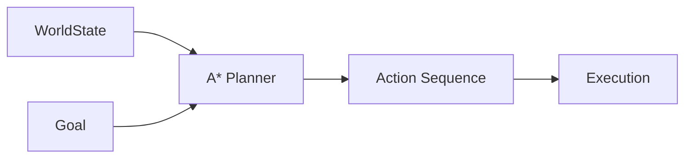
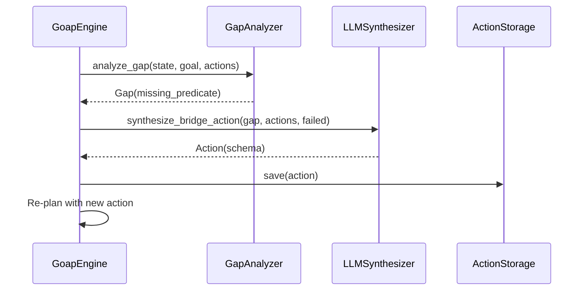

# Core Concepts & Architecture

`heal-my-goap` is engineered around four foundational pillars that bridge symbolic planning and modern LLM intelligence.

!!! abstract "At a Glance"
    This page explains the four pillars of `heal-my-goap`: zero-token symbolic GOAP planning, diagnostic gap isolation, LLM self-healing synthesis, and runtime state delta observation.

**Prerequisites**: [Installation](installation.md) complete.

**What you'll learn**:

- How GOAP differs from LLM-based agent frameworks
- How `GapAnalyzer` isolates missing predicates when plans fail
- How `LLMSynthesizer` generates bridge actions via OpenRouter
- How `DeltaObserver` automates effect learning from live execution

---

## 1. Zero-Token Symbolic GOAP Planning

Traditional AI agent frameworks (e.g. ReAct, Plan-and-Solve) call an LLM at every execution step to pick tools. This introduces:
- High financial API costs
- Latency (1-3 seconds per step)
- Non-deterministic behavior and hallucinations

`heal-my-goap` uses **Goal-Oriented Action Planning (GOAP)** powered by local A* graph search (`goapauto==0.3.0`). Given an initial `WorldState` and a target `Goal`, the A* planner finds the lowest-cost sequence of `Action` steps in under **1 millisecond** at **$0.00 token cost**.



---

## 2. Diagnostic Gap Isolation (`GapAnalyzer`)

When an environment changes and no valid plan path exists from the initial `WorldState` to the `Goal`, symbolic planners usually throw an unhelpful error.

`heal-my-goap` includes a `GapAnalyzer` that performs backward goal graph traversal and frontier node expansion to isolate the exact unsatisfied precondition predicate—termed a **`Gap`**.

```python
# Isolated Gap Example
Gap(
    missing_predicate={"types_installed": True},
    dependent_action_name="run_type_checker_mypy",
    closest_state={"code_written": True, "lint_clean": True},
)
```

The `Gap` contains:
- `missing_predicate`: The exact predicate blocking progress
- `dependent_action_name`: Which action requires this predicate
- `closest_state`: The state at the frontier node where planning stopped

---

## 3. LLM Self-Healing Synthesis (`LLMSynthesizer`)

Once a `Gap` is isolated, `GoapEngine` invokes `LLMSynthesizer`. Instead of asking an LLM to plan the entire task, the LLM is asked to perform a micro-synthesis task: **Synthesize a single bridge action that satisfies the missing predicate**.

- **Structured Output**: Generates a valid JSON `Action` schema.
- **Retry Memory**: Remembers failed action synthesis attempts to avoid repeating mistakes.
- **In-Place Persistence**: Stores newly learned actions in `.goap_actions.json` so future runs execute at zero token cost.



---

## 4. Runtime State Delta Observer (`DeltaObserver`)

Manual GOAP action modeling requires developers to explicitly specify all preconditions and effects.

`DeltaObserver` automates state formalization by observing live environment states before and after action execution (`after_state - before_state`):

- **Noise Filtering**: Automatically ignores ambient OS fluctuations (`uptime_minutes`, `load_avg_1m`, `network_bytes_sent`).
- **Configurable Merge Strategies**: Combines observed deltas using `"update"`, `"preserve_existing"`, or `"overwrite"` policies.

```python
from heal_my_goap import DeltaObserver

observer = DeltaObserver(
    ignored_keys={
        "uptime_minutes",
        "network_bytes_sent",
        "network_bytes_recv",
        "cpu_usage_pct",
        "load_avg_1m",
        "process_memory_rss",
    },
    numeric_tolerance=0.1,
    merge_strategy="update",
)
```

---

## Related Pages

- [Installation](installation.md)
- [Tool Registration Guide](../user-guide/tool-ingestion.md)
- [Delta Observer Guide](../user-guide/delta-observer.md)
- [Self-Healing Guide](../user-guide/self-healing.md)
- [API Reference: Models](../api-reference/models.md)