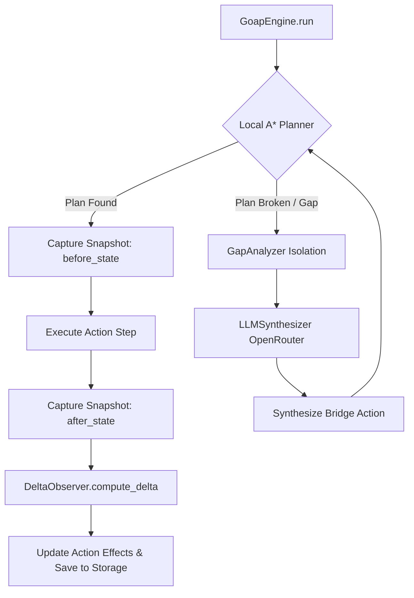

<div class="hero-banner">
  <h1>heal-my-goap 🩹🤖</h1>
  <p>Production-ready Goal-Oriented Action Planning (GOAP) with zero-token runtime A* pathfinding and LLM-powered self-healing via OpenRouter.</p>
  <p>
    <a href="getting-started/installation/" class="md-button md-button--primary">Get Started</a>
    <a href="getting-started/concepts/" class="md-button">Core Concepts</a>
  </p>
</div>

!!! tip "New here? Recommended reading order"
    1. [Installation](getting-started/installation.md) — Get set up in 30 seconds
    2. [Core Concepts](getting-started/concepts.md) — Understand GOAP, gaps, and self-healing
    3. [Coding Agent Example](examples/coding-agent.md) — See a full 8-step autonomous pipeline
    4. [Tool Registration](user-guide/tool-ingestion.md) — Register your own tools

---

## Why heal-my-goap?

Standard LLM agent harnesses rely on expensive LLM calls for every tool selection step. Pure symbolic planners (like standard GOAP) are fast and 100% deterministic, but break as soon as an unexpected obstacle or missing action precondition occurs.

**heal-my-goap** bridges this gap:
- **Zero-Token Runtime Execution**: Executes local A* pathfinding via `goapauto` at 0 token cost.
- **Automated Self-Healing**: When a plan is blocked, `GapAnalyzer` pinpoints missing state predicates, and `LLMSynthesizer` generates dynamic bridge actions.
- **Runtime State Observation**: `DeltaObserver` observes real-world side effects (`after_state - before_state`) to refine action definitions automatically over time.

---

## Features at a Glance

<div class="grid cards">
  <div>
    <h3>⚡ Zero-Token Pathfinding</h3>
    <p>Local A* search powered by <code>goapauto==0.3.0</code> for high-performance symbolic plan generation.</p>
  </div>
  <div>
    <h3>🤖 OpenRouter LLM Synthesis</h3>
    <p>Auto-generate structured bridge actions when execution gaps are encountered, with failure retry memory.</p>
  </div>
  <div>
    <h3>👁️ Runtime Delta Observer</h3>
    <p>Track live environment changes without manual predicate modeling or LLM extraction fees.</p>
  </div>
  <div>
    <h3>🛠️ Ergonomic Tool Ingestion</h3>
    <p>Convert Python callables and JSON schema dicts directly into GOAP actions via <code>action_from_tool</code>.</p>
  </div>
  <div>
    <h3>💾 Deduplicated Persistence</h3>
    <p>Locally persist learned actions in <code>.goap_actions.json</code> with bounded in-place updates.</p>
  </div>
  <div>
    <h3>📊 Live OS Sensor Suite</h3>
    <p>Read 28+ real-time OS metrics (RAM, CPU, disk, process RSS, swap, network connections) via <code>SystemSensors</code>.</p>
  </div>
</div>

---

## Architecture Flow



---

## Quick Example

```python
from heal_my_goap import (
    Action,
    DeltaObserver,
    Goal,
    GoapEngine,
    WorldState,
    action_from_tool,
)


# 1. Register a Python callable tool (1)!
def clean_temp_files() -> None:
    """Deletes temporary files from disk."""
    print("🧹 Cleaning temporary files...")


tool_action = action_from_tool(
    name="clean_temp_files",
    description="Deletes temporary files from disk",
    parameters=clean_temp_files,
    effects={"temp_files_count": 0},
    cost=5.0,
)

# 2. Baseline action (2)!
open_door = Action(
    name="open_door",
    preconditions={"has_key": True},
    effects={"door_open": True},
    cost=1.0,
)

# 3. GoapEngine Orchestrator (3)!
engine = GoapEngine(
    initial_actions=[open_door],
    tools=[tool_action],
    observer=DeltaObserver(),
    storage_path=".goap_actions.json",
)

result = engine.run(
    initial_state=WorldState(
        has_key=False, door_open=False, temp_files_count=10
    ),
    goal=Goal(target_state={"door_open": True}),
)

print(f"Plan Success: {result.success}")
```

1. Import the engine orchestrator and UX helpers.
2. Define a baseline symbolic action with preconditions/effects.
3. Convert a Python callable into a GOAP action with `action_from_tool`.
4. Instantiate `GoapEngine` with tools, observer, and persistence.
5. Run the engine — it plans, executes, observes, and self-heals automatically.

---

## Related Pages

- [Installation](getting-started/installation.md)
- [Core Concepts](getting-started/concepts.md)
- [Tool Registration Guide](user-guide/tool-ingestion.md)
- [API Reference: GoapEngine](api-reference/engine.md)
- [Example: Coding Agent](examples/coding-agent.md)