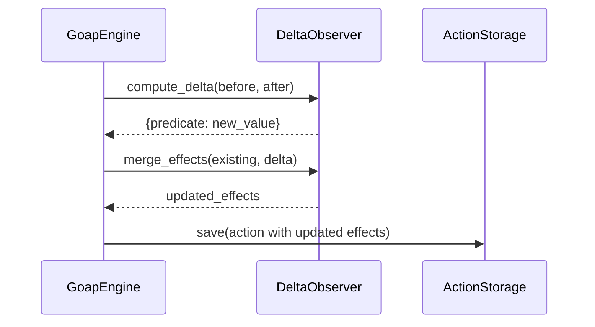

# Runtime State Delta Observer (`DeltaObserver`)

`DeltaObserver` formalizes action side effects dynamically without manual data modeling or expensive LLM extraction calls.

!!! abstract "At a Glance"
    Learn how `DeltaObserver` captures state snapshots before and after action execution, computes predicate deltas, filters noise, and merges observed effects into action definitions.

**Prerequisites**: [Installation](../getting-started/installation.md) complete.

**What you'll learn**:

- How the delta observation lifecycle works (before/after snapshots)
- How to configure ambient noise filtering for OS metrics
- The three merge strategies and when to use each
- How to integrate `DeltaObserver` with `GoapEngine` via `state_refresh_callback`

---

## How It Works

1. Prior to action execution, `GoapEngine` captures a snapshot (`before_state`).
2. The action handler or sandboxed code executes.
3. Post execution, `GoapEngine` captures a snapshot (`after_state`).
4. `DeltaObserver.compute_delta(before_state, after_state)` calculates predicate changes (`after_state - before_state`).
5. Observed deltas are merged into `action.effects` using the configured `merge_strategy` and persisted to `.goap_actions.json`.



---

## Ambient Noise Filtering

OS metrics like CPU usage, network byte counters, and uptime change constantly. `DeltaObserver` ignores volatile background keys by default:

```python
from heal_my_goap import DeltaObserver

observer = DeltaObserver(
    ignored_keys={
        "uptime_minutes",
        "network_bytes_sent",
        "network_bytes_recv",
        "cpu_usage_pct",
        "load_avg_1m",
        "process_memory_rss",
    },
    numeric_tolerance=0.1,  # Ignore float changes smaller than 0.1
)
```

**Default ignored keys**: `uptime_minutes`, `network_bytes_sent`, `network_bytes_recv`, `cpu_usage_pct`, `load_avg_1m`, `process_memory_rss`.

**`numeric_tolerance`**: Minimum floating-point difference required to record a state change (default `0.001`).

---

## Merge Strategies

`DeltaObserver` supports 3 merge strategies to control how observed deltas update existing action effects:

```python
observer = DeltaObserver(merge_strategy="update")
```

| Merge Strategy | Behavior |
| :--- | :--- |
| `"update"` (Default) | Merges newly observed deltas, overwriting existing keys if changed and preserving un-observed keys. |
| `"preserve_existing"` | Keeps existing action effect values for existing keys, only adding newly discovered predicate keys. |
| `"overwrite"` | Completely replaces existing action effects with the newly observed state delta. |

---

## Integrating with `GoapEngine`

Supply a `state_refresh_callback` to `GoapEngine` so live state snapshots can be captured around action steps:

```python
def get_live_state() -> dict[str, Any]:
    return system_sensors.read_state()


engine = GoapEngine(
    observer=DeltaObserver(),
    state_refresh_callback=get_live_state,
)
```

The callback should return a `dict` or `WorldState` representing the current environment state.

---

## Related Pages

- [Tool Registration](tool-ingestion.md)
- [Self-Healing Guide](self-healing.md)
- [API Reference: DeltaObserver](../api-reference/observer.md)
- [API Reference: SystemSensors](../api-reference/sensors.md)
- [Example: Coding Agent](../examples/coding-agent.md)